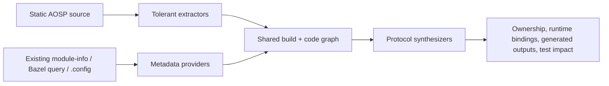

# AOSP support execution record

This document is the auditable record for the Android AOSP support plan. It is
updated with implementation evidence as milestones land; a checked item means
the cited code and validation exist in the working tree, not merely that the
work was planned.

## Baseline

- Upstream revision: `c6aaa20358cd6adcd04b87bdef8e5803ad146f3a`
- Baseline build: `npm run build` — passed.
- Baseline focused suite: 612 tests passed across `extraction.test.ts` and
  `android-res-exclusion.test.ts`.
- Project AI instructions imported from `.claude/skills/add-lang/SKILL.md` and
  `.claude/skills/agent-eval/SKILL.md` before production changes.

## Gap assessment and delivery priority

The initial assumption was correct and explicitly included Android Make:
`Android.mk`/Kati was a P0 build-ownership gap alongside Android.bp/Soong.

| Priority | Gap | Feasibility conclusion | Delivered implementation |
|---|---|---|---|
| P0 | AOSP discovery and graph vocabulary | High; path conventions are deterministic | AOSP profile, special filenames, append-only node/edge/language kinds, extraction-version bump |
| P0 | Android.bp/Soong | High for literal declarations; full evaluation requires Soong | Module/dependency/source/output extraction plus module-info enrichment |
| P0 | Android.mk/Kati | Medium; assignments and standard macros are safe, arbitrary Make is dynamic | `LOCAL_*`, `BUILD_*`, product packages and inherit-product extraction |
| P0 | Bazel/Starlark/Kleaf | High for rule declarations; configured graph requires query output | Static labels/select plus captured query/cquery provider and CLI import |
| P0 | AIDL/Binder | High for declarations; generated transaction details require compiler output | Declarations, stable interface metadata/backends, Binder convention bridges |
| P0 | JNI | Medium; exact symbols/tables/literals are reliable, dynamic strings are not | Static JNI, RegisterNatives, and native-to-Java callback bridges |
| P1 | DTS/DTSI and binding schemas | High for syntax and exact compatible strings | Device/include/phandle/overlay extraction, schema and driver bridges |
| P1 | HIDL/VINTF | High for declarations and explicit instances | HIDL interfaces/methods and VINTF instance binding |
| P1 | init/sysprop/SELinux | Medium; literal configuration is safe, macro expansion is external | Services/triggers/properties/types/contexts and runtime bindings |
| P1 | Android resources/RRO | High with an AOSP-only scan profile | Manifest/resource/layout/RRO nodes and edges without changing app defaults |
| P1 | Kconfig/Kbuild | Medium; declarations are static, selected values require `.config` | Symbols/dependencies/objects plus existing `.config` import provider |
| P2 | Proto | High | Messages/enums/services/RPC/import relationships |
| P2 | TEST_MAPPING/Tradefed/test impact | High for metadata; final selection remains build-variant dependent | TEST_MAPPING and Tradefed extraction, module-info test_config edges, reverse build test impact |

The implementation intentionally uses two evidence planes: static source
extraction is always safe and zero-build; authoritative enrichment only reads
artifacts the user already produced. CodeGraph never runs Soong, Kati, Bazel,
dtc, Kconfig, or an AOSP build as a side effect.

An independent review of feature commit `f3e49ca` produced 15 findings. The
complete disposition, including the one deliberately authorization-gated item,
is recorded in [`docs/reviews/aosp-review-remediation.md`](../reviews/aosp-review-remediation.md).

## Gap-by-gap implementation plans and results

Each plan below records the original gap, the feasibility boundary chosen
before implementation, the concrete breakdown, and the acceptance evidence.
Checked tasks are implemented in this working tree. “Exact” means backed by a
literal declaration or imported build artifact; it does not mean CodeGraph has
silently reimplemented an Android build tool.

### G1 — AOSP discovery and graph contract (P0)

- **Feasibility:** high. Canonical filenames and workspace markers are stable;
  the native wire tables require append-only changes for compatibility.
- **Breakdown:** [x] detect AOSP roots; [x] recognize special filenames and new
  extensions; [x] append node/edge/language kinds in TypeScript and Rust; [x]
  bump the extraction version; [x] preserve normal Android resource defaults;
  [x] restore root AOSP `build/` and `vendor/` source trees without admitting
  nested generated/dependency copies.
- **Implementation:** `aosp-artifacts.ts` owns artifact/workspace detection,
  `grammars.ts` owns language routing, and the AOSP resource profile is applied
  by the scanner. `aosp.enabled` can force or suppress that profile.
- **Acceptance:** discovery cases, false-positive workspace cases, resource
  profile tests, and a TypeScript/Rust wire-table parity test all pass.

### G2 — Android.bp / Soong build ownership (P0)

- **Feasibility:** high for literal module properties; selected defaults,
  namespaces, product variables, and mutators require Soong evaluation.
- **Breakdown:** [x] modules and module types; [x] `srcs`, dependency families,
  defaults, generated outputs and product packages; [x] shared build-target
  model; [x] exact product enrichment from an existing `module-info.json`.
- **Implementation:** the static extractor produces `build_target`, reference,
  dependency, and generated-output evidence. The module-info provider adds
  selected-product dependencies, installed outputs, variants, and test config.
- **Acceptance:** focused extraction tests and temporary-project enrichment
  prove static target reuse in hybrid mode and separation in authoritative mode.

### G3 — Android.mk / Kati / product Make (P0)

- **Feasibility:** medium. Standard `LOCAL_*` and product macros are tractable;
  arbitrary GNU Make/Kati expansion is intentionally not evaluated.
- **Breakdown:** [x] recognize `Android.mk`, `BoardConfig.mk`, and Make-family
  files; [x] extract `CLEAR_VARS`/`BUILD_*` module blocks; [x] sources and
  library dependencies; [x] `PRODUCT_PACKAGES`; [x] `inherit-product` edges;
  [x] merge authoritative module-info evidence.
- **Implementation:** one tolerant Make scanner converts common assignment and
  macro idioms into the same model used by Soong and Bazel.
- **Acceptance:** Android.mk is explicitly covered by discovery, extraction,
  build-model, and fixture tests. Computed variable expansion remains a Kati
  responsibility and is recovered through `module-info.json` when available.

### G4 — Bazel / Starlark / Kleaf (P0)

- **Feasibility:** high for syntax and literal labels; exact configured edges
  require Bazel query output because `select()` and transitions are dynamic.
- **Breakdown:** [x] pinned Starlark grammar; [x] rules, attributes, `load`,
  labels, `glob` include patterns, outputs, and every literal `select()` branch
  with its condition retained in extraction/static-provider metadata; [x] Kleaf rule
  classification; [x] legacy flat capture import; [x] real query and cquery
  `jsonproto` envelopes; [x] configuration IDs/mnemonics and exact labels.
- **Implementation:** `BazelQueryBuildGraphProvider` accepts Bazel `Target`
  envelopes and `CqueryResult.results/configurations`, including protobuf JSON's
  snake_case and camelCase field spellings. No Bazel process is launched.
- **Acceptance:** separate tests cover flat, query-jsonproto, and configured
  cquery-jsonproto captures; static tests assert both positive branch/glob
  evidence and exclusion of `glob(exclude=...)` patterns. Schema alignment was
  checked against Bazel's
  [cquery docs](https://bazel.build/query/cquery),
  [`analysis_v2.proto`](https://github.com/bazelbuild/bazel/blob/master/src/main/protobuf/analysis_v2.proto),
  and [`build.proto`](https://github.com/bazelbuild/bazel/blob/master/src/main/protobuf/build.proto).

### G5 — AIDL and Binder bridges (P0)

- **Feasibility:** high for source declarations and generated naming
  conventions; compiler-assigned transactions cannot be safely invented.
- **Breakdown:** [x] packages/imports/interfaces/methods/data declarations;
  [x] inheritance; [x] stable-interface versions, stability, frozen state,
  imports and backends; [x] Java/Kotlin/C/C++/Rust convention bridges.
- **Implementation:** AIDL nodes and references are extracted first; the AOSP
  synthesis registry then adds exact/convention-backed Binder edges with
  provenance, evidence, and confidence metadata.
- **Acceptance:** extraction and synthesis suites cover declarations, stable
  metadata, generated backend nodes, and implementation bindings.

### G6 — bidirectional JNI (P0)

- **Feasibility:** medium. Mangled static JNI names, literal native method
  tables, and literal callback lookups are reliable; computed strings are not.
- **Breakdown:** [x] static `Java_pkg_Class_method` bindings; [x]
  `JNINativeMethod` tables and RegisterNatives/RegisterMethods; [x] signature
  evidence; [x] reverse native-to-Java callbacks requiring co-located
  `FindClass`, `GetMethodID`, and `Call*Method` evidence.
- **Implementation:** the synthesizer joins existing Java/Kotlin and C/C++
  nodes without changing their language extractors, and annotates every bridge.
- **Acceptance:** unit cases cover static, registered, overloaded/signature,
  callback, ambiguous, and negative paths; end-to-end indexing persists a JNI
  call edge in a real graph database.

### G7 — DTS/DTSI, overlays, schemas, and drivers (P1)

- **Feasibility:** high for syntax, includes, phandles, and compatible strings;
  validation and preprocessing remain responsibilities of dtc/dt-schema.
- **Breakdown:** [x] pinned Device Tree grammar; [x] nodes/labels/properties;
  [x] includes/phandles; [x] overlays; [x] binding YAML compatible and `$ref`;
  [x] exact compatible-to-schema and compatible-to-driver/probe bridges.
- **Implementation:** static DTS extraction and metadata YAML extraction feed
  compatible-string indexes used by the synthesizer.
- **Acceptance:** extraction, metadata, and synthesis tests cover all three
  evidence sources; grammar health is recorded separately below.

### G8 — HIDL and VINTF (P1)

- **Feasibility:** high for explicit source interfaces and manifest instances;
  runtime service discovery outside the manifest is not inferred.
- **Breakdown:** [x] HIDL packages/interfaces/methods/inheritance; [x] AIDL and
  HIDL VINTF HALs, versions, instances and transports; [x] exact instance binds.
- **Implementation:** HIDL uses the AOSP DSL extractor, VINTF uses the Android
  XML extractor, and synthesis joins compatible interface/instance identities.
- **Acceptance:** XML, extraction, and synthesis suites cover both HIDL and AIDL
  HAL forms and verify persisted `binds` edges.

### G9 — init rc, sysprop, and SELinux (P1)

- **Feasibility:** medium. Literal services, triggers, properties, types, rules,
  and context mappings are safe; m4/CIL expansion and merged policy are not.
- **Breakdown:** [x] init services/actions/property triggers/imports; [x]
  sysprop declarations; [x] SELinux `.te` and literal CIL
  types/attributes/allow rules; [x] service/property/file/genfs/port contexts;
  [x] service-to-binary, property, and policy bindings.
- **Implementation:** dedicated tolerant scanners produce service/resource
  nodes, then runtime/policy synthesizers join exact names and paths.
- **Acceptance:** positive and negative extraction/synthesis cases pass, and the
  end-to-end fixture persists an init-service-to-build-target binding.

### G10 — AndroidManifest, resources, layouts, and RRO (P1)

- **Feasibility:** high for XML declarations. AOSP needs an opt-in scan profile
  because ordinary Android apps intentionally exclude large `res/` trees.
- **Breakdown:** [x] manifest package/components/permissions; [x] resource
  declarations and references; [x] layout callbacks; [x] overlay targets/maps;
  [x] detected/forced/disabled resource profile semantics.
- **Implementation:** a path-aware Android XML extractor handles manifest,
  resource, RRO, VINTF and Tradefed dialects without treating every XML file as
  Android metadata.
- **Acceptance:** XML suites prove the graph shapes; scan-policy regression
  tests prove AOSP resources are included while ordinary app behavior is kept.

### G11 — Kconfig, Kbuild, and selected kernel configuration (P1)

- **Feasibility:** medium. Static declarations and config-gated objects are
  safe; final values require an existing `.config`/defconfig.
- **Breakdown:** [x] symbols, dependencies, selects, sources, and Kbuild object
  gates; [x] parse `CONFIG_X=value` and “is not set”; [x] CLI/config input;
  [x] persist selected values; [x] exact selected-value-to-declaration edges.
- **Implementation:** `KernelConfigProvider` reads an existing file only.
  `enrichAosp({kernelConfig})` and `--kernel-config` create `selected:CONFIG_*`
  nodes and `configures` edges, and report their counts.
- **Acceptance:** provider unit tests plus an indexed Kconfig/.config integration
  test prove the selected values and graph edges. No Kconfig tool is invoked.

### G12 — Protocol Buffers (P2)

- **Feasibility:** high for `.proto` syntax; generated language bindings are
  already covered by normal source-language extractors when present.
- **Breakdown:** [x] packages/imports; [x] messages/enums; [x] services/RPCs;
  [x] request/response and import relationships.
- **Implementation:** Proto shares the tolerant AOSP artifact extractor and
  emits ordinary symbol/reference kinds so existing resolution can participate.
- **Acceptance:** focused extraction fixtures cover declarations and RPC edges.

### G13 — TEST_MAPPING, Tradefed, and affected-test flow (P2)

- **Feasibility:** high for metadata topology. Exact runnable selection still
  depends on the selected product/build variant.
- **Breakdown:** [x] TEST_MAPPING groups/imports/options; [x] Tradefed test and
  preparer components/options; [x] module-info `test_config`; [x] reverse test
  dependency edge; [x] test-file classification; [x] real `codegraph affected`.
- **Implementation:** test configuration nodes point back to their owning build
  module so the existing dependent-file traversal reaches AndroidTest.xml from
  a changed source. Classification is intentionally narrow and does not mark
  arbitrary production files as tests.
- **Acceptance:** the end-to-end suite indexes a temporary AOSP project, imports
  module-info, runs the built CLI, and verifies a changed C++ source reports the
  expected AndroidTest.xml.

### G14 — unified authoritative build graph and public API (P0, cross-cutting)

- **Feasibility:** high if CodeGraph consumes artifacts rather than launching
  product builds. Static and selected-product truth must remain distinguishable.
- **Breakdown:** [x] provider interface/shared target model; [x] ownership,
  dependency closure, and impacted tests; [x] hybrid deterministic merge; [x]
  authoritative separation; [x] config enforcement; [x] public package exports;
  [x] metadata-only CLI with JSON output.
- **Implementation:** `AospBuildGraph` and all provider/model types are exported
  from the package entry. `buildGraph=static` rejects enrichment,
  `authoritative` keeps imported nodes separate, and `hybrid` reuses a unique
  matching source target before adding exact edges.
- **Acceptance:** API/model tests, config-mode tests, CLI help, Bazel-only,
  module-info-only, and kernel-config-only integration paths all pass.

## Completion-audit findings and remediation

The initial completion audit did not accept feature names as proof. It found
places where an implementation existed but the user-visible requirement was
not yet proven; the following gaps were corrected before the feature commit.

| Audit finding | Why the earlier evidence was insufficient | Remediation and proof |
|---|---|---|
| `aosp.enabled` and `buildGraph` parsed but did not fully control enrichment/profile behavior | A config type alone does not prove runtime semantics | Scanner profile now honors auto/true/false; enrichment rejects disabled/static, separates authoritative nodes, and tests all modes |
| Bazel provider accepted only a convenient flat JSON shape | That was not evidence of support for Bazel's actual output | Added query and cquery jsonproto envelope/configuration parsing with official-schema tests |
| An in-memory `impactedTests()` method existed | It did not prove the shipped `codegraph affected` path returned AOSP tests | Added narrow test classification and reverse module test-config edges; end-to-end test executes the built CLI |
| Kernel `.config` provider existed but was disconnected | A parser with no API/CLI/graph integration was not a delivered gap | Added config/API/CLI input, selected nodes, exact Kconfig edges, result counts, public export, and integration test |
| Generic scanner still excluded root `build/` and `vendor/` | Full AOSP roots would silently lose Soong/Kati and vendor product/policy source despite passing isolated extractor tests | AOSP profile now root-unignores those two source trees, keeps nested copies and `out/.repo` excluded, and tests both AOSP and ordinary-project behavior |
| Starlark docs named `glob` and `select`, but tests only observed a direct list beside `select()` | A label in a test name is not evidence that branch values were extracted | Added balanced attribute-expression scanning, condition-tagged literal branches, glob include patterns, exclude suppression, and positive/negative assertions |
| Device Tree overlay test did not assert an overlay edge | Nodes/includes/phandles passing did not prove overlay support | Added fragment target and `&label {}` overlay extraction plus explicit edge assertions |
| Supported-language listing duplicated grammar-backed AOSP languages | Runtime support worked, but SDK enumeration was not a clean contract | Deduplicated the public list and added a uniqueness/API coverage assertion |
| SELinux file-context paths and CIL syntax were named but not actually modeled | Leading `/` paths were skipped before context extraction, `.fc` missed the context branch, and `.cil` was being read as `.te` | Reordered literal context extraction, added `.fc` and additional canonical context files, added basic CIL s-expression types/attributes/rules, and asserted all paths |
| JNI “signature/overload” support was documented without a matching test or implementation | Long JNI names discarded the `__descriptor`, so overloads could only be skipped as ambiguous | Added Java/Kotlin parameter-descriptor normalization, long-name and RegisterNatives signature filtering, an exact-overload test, an ambiguous-short-name negative test, and a missing-callback-invocation negative test |
| AIDL forward parcelables could inherit the next declaration's body range | The parser searched for the next `{` without checking whether `;` ended the current declaration | Bounded body detection by the nearest terminator, added parcelable/union/enum assertions, and added method return-type references |
| Device Tree driver synthesis reread every C/C++ file for every device | Small fixtures passed, but the algorithm would multiply device count by source-file count on a full platform | Built single-pass compatible-to-probe and compatible-to-schema indexes; existing exact-edge tests pass unchanged |

The audit also made the build-model providers and types public at the package
entry point, so the documented ownership/closure/impact functionality is usable
by SDK consumers rather than only by internal tests.

## M0 — AOSP foundations

### Completed

- [x] Appended generic `build_target`, `service`, `resource`, and `device` node
  kinds without reordering the native wire table.
- [x] Appended `depends_on`, `generates`, `binds`, `configures`, and `overlays`
  edge kinds and mirrored both kind tables in the Rust kernel.
- [x] Added path-level classification for extensionless AOSP artifacts such as
  `Android.bp`, `Android.mk`, `BUILD`, `Kconfig`, `Kbuild`, and SELinux context
  files.
- [x] Added extension discovery for AIDL, Blueprint, Starlark, Device Tree,
  Android Make, HIDL, Proto, init rc, sysprop, SELinux, and Kconfig inputs.
- [x] Added conservative AOSP workspace detection based on `.repo`, Soong/Make,
  or canonical AOSP source-tree markers.
- [x] Bumped the extraction version from 25 to 26 for the feature, then to 27
  during review remediation so indexes created before unresolved-reference
  metadata persistence are reported as stale.

### Evidence

- Implementation: `src/extraction/aosp-artifacts.ts`,
  `src/extraction/grammars.ts`, `src/types.ts`, and
  `codegraph-kernel/src/buffers.rs`.
- Tests: `__tests__/aosp-artifacts.test.ts`.

### Remaining before M0 exit

- [x] AOSP-specific scan/resource policy: `.repo` and `out` stay excluded;
  framework resources are indexed only for detected AOSP workspaces.
- [x] Shared static/authoritative build graph/provider interfaces, ownership
  lookup, dependency closure, and deterministic merge.
- [x] Cross-language graph synthesizer registry with JNI, AIDL/Binder,
  Device Tree/driver, init/build, VINTF, and SELinux bridges.
- [x] Full TypeScript build and focused AOSP tests after foundation edits.

## M1 — Build ownership and authoritative enrichment

### Completed

- [x] Android.bp module/source/dependency/default/generated-output extraction.
- [x] Android.mk common `LOCAL_*`, `BUILD_*`, `PRODUCT_PACKAGES`, and
  `inherit-product` extraction.
- [x] Bazel/Starlark/Kleaf target, load, label, source/dependency, and
  conservative `select` extraction.
- [x] Shared `BuildTarget` model across Soong, Make, Bazel, and Kleaf.
- [x] Existing `module-info.json` import and static/authoritative merge.
- [x] Existing Bazel query/cquery JSON import for configured Bazel/Kleaf edges.
- [x] Per-translation-unit `compile_commands.json` include paths, including the
  configured non-default path in `codegraph.json`.
- [x] `codegraph aosp enrich` CLI; it never invokes a build command.
- [x] Build DSL source references are allowed to resolve across language-family
  boundaries after exact path/name matching.

## M2 — AIDL/Binder/JNI

### Completed

- [x] AIDL packages, imports, interfaces, methods, parcelables, unions, enums,
  and inheritance.
- [x] AIDL interface/method binding to Java/Kotlin/C/C++/Rust convention-backed
  generated or implementation types.
- [x] Static JNI encoded-name binding.
- [x] `JNINativeMethod` plus RegisterMethods/RegisterNatives binding using class,
  method, signature, and native function evidence.
- [x] Native-to-Java callback binding requiring `FindClass`, `GetMethodID`, and
  `Call*Method` evidence inside the same native function.
- [x] Stable AIDL versions/stability/frozen metadata, imported interfaces, and
  generated backend virtual nodes.

### Deliberate precision boundary

- Dynamic JNI class or method names are left unresolved instead of guessed.
- AIDL source parsing is tolerant and non-evaluating; compiler-assigned Binder
  transaction codes are not invented.

## M3/M4/M5 coverage landed

- [x] DTS/DTSI includes, nodes, labels, compatibles, phandles, overlays, and
  compatible-to-driver-probe binding.
- [x] Devicetree binding YAML schemas, `$ref` relationships, and exact
  compatible-to-schema binding.
- [x] HIDL declarations and VINTF AIDL/HIDL HAL instances.
- [x] init service/action/property graph and service-to-build-target binding.
- [x] SELinux types/rules/contexts plus service/property policy binding.
- [x] AndroidManifest components/permissions, resources, layout callbacks,
  RRO maps/targets, and selective AOSP resource indexing.
- [x] Proto message/service/RPC extraction.
- [x] Kconfig symbols/dependencies and Kbuild config-gated objects.
- [x] Existing kernel `.config`/defconfig selected-value provider.
- [x] TEST_MAPPING groups/imports/options and Tradefed components/options.
- [x] module-info `test_config` edges and reverse build-dependency test impact.

## Grammar evidence

- Starlark `tree-sitter-starlark@1.3.0`: ABI 14, 50/50 clean repeated
  multi-grammar parses.
- Device Tree `tree-sitter-devicetree@0.15.0`: ABI 15, 50/50 clean repeated
  multi-grammar parses.
- These WASMs are pinned health/provenance inputs. Production grammar expansion
  filters both dedicated custom extractors before byte read, worker broadcast,
  or instantiation; the runtime scanners remain the tolerant AOSP extractors.
- AST discovery output verified the Starlark call/keyword-argument and Device
  Tree node/property/reference shapes. Reproduction and artifact provenance are
  in `docs/grammars/tree-sitter-aosp.md`.

## Milestone status

| Milestone | Status | Notes |
|---|---|---|
| M0 foundations | Completed | Discovery, graph contract, profile, build model, synthesis registry. |
| M1 Soong/build ownership | Completed within declared static/metadata scope | Static Soong/Make/Bazel plus module-info and real Bazel jsonproto import; full evaluators intentionally remain external. |
| M2 AIDL/Binder/JNI | Completed within static-evidence scope | Stable AIDL, Binder conventions, and bidirectional exact-evidence JNI bridges. |
| M3 device/kernel build path | Completed within static/metadata scope | DTS/schema/driver, Kconfig/Kbuild/Kleaf, query and selected-config providers. |
| M4 HAL/init/policy | Completed within static-evidence scope | HIDL/VINTF/init/sysprop/SELinux; macro expansion remains an external-tool boundary. |
| M5 resources/proto/test impact | Completed within metadata scope | Resources/RRO/Proto/TEST_MAPPING/Tradefed and build-based impact. |

## Implementation inventory

- Discovery/profile: `src/extraction/aosp-artifacts.ts`,
  `src/extraction/grammars.ts`, `src/extraction/index.ts`.
- Static DSLs: `src/extraction/aosp-extractor.ts`.
- TEST_MAPPING and binding YAML: `src/extraction/aosp-metadata-extractor.ts`.
- Android XML and Tradefed: `src/extraction/android-xml-extractor.ts`.
- Build model/providers: `src/aosp/build-graph.ts`.
- Cross-language/runtime bridges: `src/resolution/aosp-synthesizer.ts`.
- Public enrichment and CLI: `src/index.ts`, `src/bin/codegraph.ts`.
- Wire contract: `src/types.ts`, `codegraph-kernel/src/buffers.rs`.
- Tests: six AOSP-specific suites plus Android resource and C++ resolution
  regressions under `__tests__/`.

## Real-repository smoke benchmark

The benchmark is deliberately bounded to 2,500 matching AOSP artifacts per
repository and performs extraction only—no Android build and no paid agent run.
Times are single local observations, useful as smoke evidence rather than a
performance guarantee.

| Repository revision | Matching files | Nodes | References | Extraction warnings | Time |
|---|---:|---:|---:|---:|---:|
| `aosp-mirror/platform_system_core@a3b721a` | 218 | 1,054 | 2,508 | 0 | 64 ms |
| `aosp-mirror/platform_build@045a3d6` | 407 | 1,599 | 1,988 | 0 | 57 ms |
| `aosp-mirror/platform_frameworks_base@1cdfff5` | 2,500 (cap reached) | 17,252 | 17,927 | 0 | 368 ms |

The unavailable `platform_hardware_interfaces` GitHub mirror was replaced by
`platform_frameworks_base`; the failed URL did not affect repository changes.

## Validation log

Validation entries include the exact command and observed result. Paid external
agent A/B runs are never started implicitly; if prerequisites are unavailable,
the engineering benchmark remains explicitly pending.

- `npm run build` — passed after all current AOSP changes.
- AOSP-specific suite — 92 tests passed across six files. It includes a real
  temporary-project `indexAll()` path that persists JNI, init/build, resource,
  build-source, selected-Kconfig, and test-impact edges; module-info, Bazel-only,
  and kernel-config-only enrichment paths; real Bazel query/cquery jsonproto;
  and an execution of the built `codegraph affected` CLI.
- Broad focused regression — 281 tests passed across ten files, adding the full
  182-test resolution suite, ordinary Android resource exclusion, shared test
  classification, and existing affected-path normalization to the AOSP suites.
- `codegraph aosp enrich --help` — passed and lists `--module-info`,
  `--bazel-query`, and `--kernel-config`. A runtime package-entry check loaded
  all six exported AOSP provider/model functions successfully.
- Both vendored grammar health commands were rerun: Starlark ABI 14 and Device
  Tree ABI 15 each produced 50 clean parses and zero error trees.
- Native wire tables are source-validated against the TypeScript arrays in the
  AOSP discovery suite. A Rust compile was not run because `cargo` is not
  installed in this workspace; the native kernel remains optional and the
  TypeScript/WASM path is the validated runtime here.
- Full suite in the restricted sandbox — 2,980 passed and 11 failed across five
  files. The failures were TCP/Unix-socket `listen EPERM`, the resulting daemon
  and real-watcher timeouts, plus one five-second multi-repo sync timeout under
  full-suite contention; none was an AOSP assertion. Those exact five suites
  were rerun with local socket/watch access and all 78 tests passed. The combined
  evidence therefore covers all executed tests; 182 native parity tests remained
  skipped by the repository's existing environment gates.

## Known residual gaps and next steps

These are explicit product boundaries, not silently claimed as complete:

1. Full Soong/Kati/Starlark evaluation remains out of process. Import
   `module-info.json` or Bazel query JSON for the selected product.
2. SELinux m4/CIL macro expansion and final merged policy are not reconstructed;
   a future provider can import build-produced policy metadata.
3. Device binding extraction reads compatible and `$ref` evidence but does not
   replace `dt-schema` validation.
4. JNI callbacks using computed class/method names are deliberately skipped.
5. Paid Claude agent A/B from `agent-eval` was not run because it incurs an
   external paid action and was not explicitly authorized. The deterministic
   extraction benchmark above is complete; comparative answer-quality scoring
   remains optional follow-up work.

Git history records the feature and remediation branches and commits. No Android
build, paid external agent run, or destructive repository action was performed.
